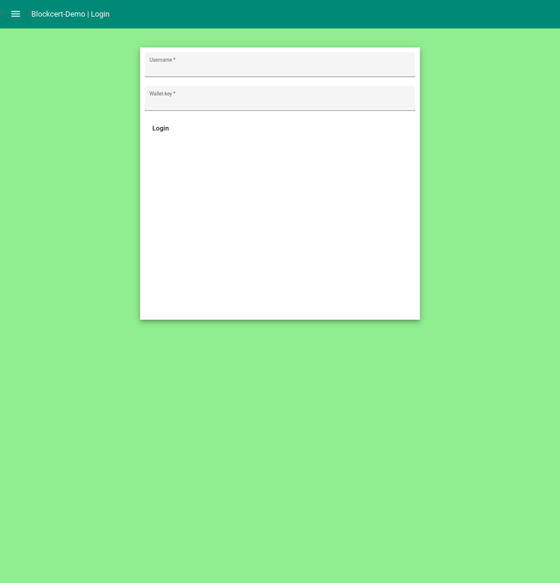

# BlockCert Demo repo
This repository contains the code developed for the BlockCert project of Spark! Living Lab. The application provides
a demonstrator that allows to showcase the application of blockchain technology in the food industry.

The application is based on Hyperledger Fabric (HLF), this is combined with a Node backend. The front-end is created using
Angular, for more information regarding the design choices we refer to the report in the deliverable. This README is
intended to provide a quick start guide to get started.

## Production setup
Note that this repository concerns the setup of a *test* network using HFL. However, the documentation following the 
attempt to setup a production network is recorded in the `charts` directory, based on the Helm charts created by Owkins.
Note that these charts require some knowledge of K8s and Helm. For more information regarding this setup, we refer to 
the documentation in the `charts` directory.

## Prerequisites
This document is written with a Linux based system in mind. The general flow of process is similar on different systems,
but it is advised to use WSL, or install a *Nix distribution to taste.

### Clone the repository
Clone the repository on your file system, using `git` or the github cli tool. Make sure that the absolute path to the
cloned directory does not contain whitespace characters, such as spaces, in order to prevent exceptional behavior 
during the rest of the setup guide.

### Install Hyperledger Fabric
Make sure to have the HLF binaries installed and added to your `PATH`, as otherwise the different commands will not 
start. Make sure to install HLF `2.3.1` as this was used during the development (latest at the time). Note that the
process requires also the setup of `docker` and `docker-compose`. For this we advise to follow the HLF's getting started
guide [found here](https://hyperledger-fabric.readthedocs.io/en/release-2.2/getting_started.html#).

### Install NodeJS and NPM
Make sure to have NodeJS installed (version 14.16.* at the time of writing) and npm. For this, you may want to use `nvm`, for
example when using a rolling release [found here](https://github.com/nvm-sh/nvm). To check whether your setup is correct
run the following commands. It's assumed that each command is executed from the resource root folder (i.e. where you
cloned the repository)


```bash
cd smart-contracts/application-typescript && npm install
cd web-application && npm install
```

If all these commands run without warnings, the setup of NodeJS and NPM has succeeded.

### Setup the test network
To setup the test network, `cd` to `smart-contracts` and execute the following command. This command may require pulling
of docker images, and as such require to login in `docker` in your terminal.

```bash
./setup.sh
```

This command requires the `HLF` binaries to be in your path. If the command has successfully completed (minus a 
`rm` command), running `docker ps` should provide output similar to the following. In case error occured, make sure
to check the logs of different docker containers, and console the `STDOUT` and `STDERR` output of the script.
From a successful startup we should expect a structure like the following.

```
CONTAINER ID   IMAGE                                                                                                                                                                     COMMAND                  CREATED          STATUS          PORTS                                            NAMES
942f0538d2a3   dev-peer0.org1.example.com-farmer_1.0-60d7f96b26bdbc061b01c93aac02037ec8346c0ec57151aba14bf15cff831e73-adc08a5c3223d18f84e35bca5e7bdb0bbc5acc07bbed81d1e3f480301354a5a6   "docker-entrypoint.s…"   21 minutes ago   Up 21 minutes                                                    dev-peer0.org1.example.com-farmer_1.0-60d7f96b26bdbc061b01c93aac02037ec8346c0ec57151aba14bf15cff831e73
2dbea3c07ed9   dev-peer0.org2.example.com-farmer_1.0-60d7f96b26bdbc061b01c93aac02037ec8346c0ec57151aba14bf15cff831e73-2ea678017fe9e3441c65b0bf0e8ce5857ccd35177d9355bd1a6adadbffd12931   "docker-entrypoint.s…"   21 minutes ago   Up 21 minutes                                                    dev-peer0.org2.example.com-farmer_1.0-60d7f96b26bdbc061b01c93aac02037ec8346c0ec57151aba14bf15cff831e73
cf8070408b6a   dev-peer0.org3.example.com-farmer_1.0-60d7f96b26bdbc061b01c93aac02037ec8346c0ec57151aba14bf15cff831e73-32c2fb7e3f2327b027358cb4f4a5630c39afb7bac2c102766d5084f0eac89c7a   "docker-entrypoint.s…"   21 minutes ago   Up 21 minutes                                                    dev-peer0.org3.example.com-farmer_1.0-60d7f96b26bdbc061b01c93aac02037ec8346c0ec57151aba14bf15cff831e73
f752e095d8a9   dev-peer0.org3.example.com-basic_1.0-1f38675c11398ea2e30f62a68302bec5ab7f35cf8cccd1bb45c4829866f2c89c-af71c7823ea361b1a45e365f0f30a8df595479bec0e7676c45848ff20aee9416    "docker-entrypoint.s…"   22 minutes ago   Up 22 minutes                                                    dev-peer0.org3.example.com-basic_1.0-1f38675c11398ea2e30f62a68302bec5ab7f35cf8cccd1bb45c4829866f2c89c
d12f13fca7de   dev-peer0.org2.example.com-basic_1.0-1f38675c11398ea2e30f62a68302bec5ab7f35cf8cccd1bb45c4829866f2c89c-9f9a5563b39c4143ca1e1719fa10df2287f3dca3d4ae2bcd47345726069e24f4    "docker-entrypoint.s…"   22 minutes ago   Up 22 minutes                                                    dev-peer0.org2.example.com-basic_1.0-1f38675c11398ea2e30f62a68302bec5ab7f35cf8cccd1bb45c4829866f2c89c
1ea2d7c11a2e   dev-peer0.org1.example.com-basic_1.0-1f38675c11398ea2e30f62a68302bec5ab7f35cf8cccd1bb45c4829866f2c89c-a6ee08773c4f57a3e35fa1272cf7f92c6b34cf52c234e412d12736e7601f9e5e    "docker-entrypoint.s…"   22 minutes ago   Up 22 minutes                                                    dev-peer0.org1.example.com-basic_1.0-1f38675c11398ea2e30f62a68302bec5ab7f35cf8cccd1bb45c4829866f2c89c
e1e3211d61d7   hyperledger/fabric-tools:latest                                                                                                                                           "/bin/bash"              23 minutes ago   Up 23 minutes                                                    cli
5a9883ff63f3   hyperledger/fabric-peer:latest                                                                                                                                            "peer node start"        23 minutes ago   Up 23 minutes   0.0.0.0:7051->7051/tcp                           peer0.org1.example.com
ffee025d7919   hyperledger/fabric-peer:latest                                                                                                                                            "peer node start"        23 minutes ago   Up 23 minutes   7051/tcp, 0.0.0.0:9051->9051/tcp                 peer0.org2.example.com
a6378538b183   hyperledger/fabric-peer:latest                                                                                                                                            "peer node start"        23 minutes ago   Up 23 minutes   7051/tcp, 0.0.0.0:11051->11051/tcp               peer0.org3.example.com
1921f8382eea   couchdb:3.1.1                                                                                                                                                             "tini -- /docker-ent…"   24 minutes ago   Up 23 minutes   4369/tcp, 9100/tcp, 0.0.0.0:5984->5984/tcp       couchdb0
31f6f97f7be4   couchdb:3.1.1                                                                                                                                                             "tini -- /docker-ent…"   24 minutes ago   Up 23 minutes   4369/tcp, 9100/tcp, 0.0.0.0:7984->5984/tcp       couchdb1
8793c48f5fed   hyperledger/fabric-orderer:latest                                                                                                                                         "orderer"                24 minutes ago   Up 23 minutes   0.0.0.0:7050->7050/tcp, 0.0.0.0:7053->7053/tcp   orderer.example.com
7d343099c783   couchdb:3.1.1                                                                                                                                                             "tini -- /docker-ent…"   24 minutes ago   Up 23 minutes   4369/tcp, 9100/tcp, 0.0.0.0:9984->5984/tcp       couchdb4
4e9703a5a50e   hyperledger/fabric-ca:latest                                                                                                                                              "sh -c 'fabric-ca-se…"   24 minutes ago   Up 24 minutes   7054/tcp, 0.0.0.0:8054->8054/tcp                 ca_org2
7585fd22e586   hyperledger/fabric-ca:latest                                                                                                                                              "sh -c 'fabric-ca-se…"   24 minutes ago   Up 24 minutes   7054/tcp, 0.0.0.0:9054->9054/tcp                 ca_orderer
fd9b6d7265e8   hyperledger/fabric-ca:latest                                                                                                                                              "sh -c 'fabric-ca-se…"   24 minutes ago   Up 24 minutes   7054/tcp, 0.0.0.0:11054->11054/tcp               ca_org3
416087bc6dec   hyperledger/fabric-ca:latest                                                                                                                                              "sh -c 'fabric-ca-se…"   24 minutes ago   Up 24 minutes   0.0.0.0:7054->7054/tcp                           ca_org1
```

### Starting the backend
Next we need to run the backend for the different organizations, i.e. the farmer, certification body and the producer.
This is achieved by running the following commands. (If you already did this to test your setup you may want to skip 
this part).

```bash
cd smart-contract/application-typescript
npm install
```
Then in three different terminals run the following commands, to start up the different backends on different ports.

```bash
npm start            # Starts the certification bodies backend
npm run farmer           # Starts the farmer backend
npm run producer         # Starts the producer backend
```

**N.B.** After re-deploying the network, the wallets created by this process will not be deleted. This can result in
errors. To resolve this either remove the `dist` directory or the `wallet` directory therein to make sure that the 
applications can re-create a wallet when needed.

Check also the `smart-contracts/typescript-application/package.json` file for more information on these commands. Furthermore,
the configuration files in `smart-contract/typescription-application/resources` can be consulted for information regarding
the ports that the different applications use. Note that the following port mapping is assumed by the application,
so make sure that no other application is using these ports. This can be checked by running `lsof` with elevated
permissions.

| Backend application | Portnumber |
|:-------------------:|:----------:|
| CA                  | 4100       |
| Farmer              | 4101       |
| Producer            | 4102       |


### Starting the web applications
Now with the blockchain being deployed and the backend up and running, the front end application can be started. This
is done by `cd`ing to the `webapplication` directory, running `npm install` and running the following three commands in
different terminals, similar to the previous step.

```bash
npm run certificate-body # Starts the certification bodies GUI
npm run farmer           # Starts the farmer GUI
npm run producer         # Starts the producer GUI
```

This will result in the different applications to spin up, and start listening on the following ports. The applications
can be accessed in an up-to-date browser, such as a Chromium based browser. Simply navigating to `localhost:<portnumber>`
, e.g. [localhost:4200](http://localhost:4200) should show an application. 

| Web application     | Portnumber |
|:-------------------:|:----------:|
| CA                  | 4200       |
| Farmer              | 4201       |
| Producer            | 4202       |



#### Registering new users
By default different users will be generated during the running of the applications. The corresponding secrets that are 
generated are as follows; For example, the user with ID 1 corresponds to the 

```angular2html
smart-contracts/application-typescript/dist/wallet
├── walletCert
│   ├── admin.id
│   └── appUser.id
├── walletFarmer
│   ├── 1.id
│   └── admin.id
└── walletProducer
    ├── admin.id
    └── appUser.id
```

However, the enrollment of new users can be simulated as follows. Effectively, this emulates the process of an administrator
that creates an account for a new user. We give an example for the Farmer peer. Other organizations do not have this
functionality, as the POC assumes that these organizations can handle the access control partially via networking.
As such, all the users share a single 'account' for these organizations.

1. First update the configuration file of the different user, this is achieved by changing the `userId` argument to the 
identifier that you want. Currently, there are no restrictions/checks on this identity, but this could be automized in 
   a future iteration.
2. Run the following commands from the root directory of the repository.
    ```bash
    cd smart-contract/application-typescript/
    npm run enrollFarmer
    ```
   

## Running the tests

For chaincode functionality tests are available, mainly for the interaction with the smart contracts that require
ABAC access control. These tests can be run using by `cd`ing into the `smart-contracts/chaincode-certificate` directory
and run `npm test`. This will run the Unit test suite that was written for the chaincode, that utilizes stubbing and spying 
to check whether behavior is as expected.

Running the `npm test` command should provide output similar to.

[comment]: <(TODO: Write up about jest tests.> 
